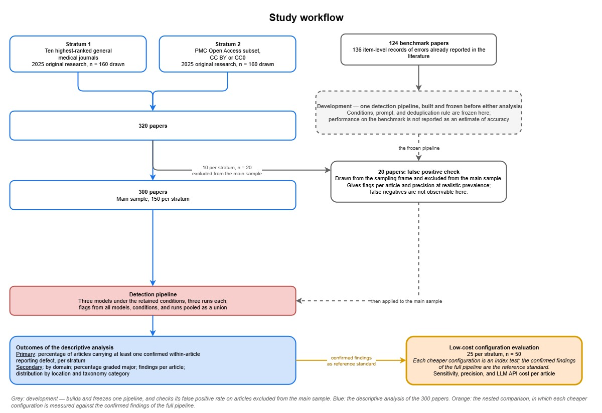

# Large language model–based auditing of scientific articles: protocol for tool development and a cross-sectional meta-epidemiological study of medical research articles

Hidehiro Someko, Keisuke Anan, Yuki Kataoka

- **Hidehiro Someko, MD**

  - ORCID: 0000-0002-7195-2055
  - Department of Internal Medicine, Nagoya Tokushukai General Hospital, 2-52 Kozojikitai, Kasugai, Aichi, 487-0016, Japan
  - Scientific Research Works Peer Support Group (SRWS-PSG), Osaka, Japan
- **Keisuke Anan, MD, DrPH**

  - ORCID: 0000-0002-2701-7334
  - Division of Respiratory Medicine, Saiseikai Kumamoto Hospital, 5-3-1 Chikami, Minami-ku, Kumamoto, 861-4193, Japan
  - Scientific Research WorkS Peer Support Group (SRWS-PSG), Osaka, Japan
- **Yuki Kataoka, MD, MPH, DrPH**

  - ORCID: 0000-0001-7982-5213
  - Center for Postgraduate Clinical Training and Career Development, Nagoya University Hospital, 65, Tsurumai-cho, Showa‑ku, Nagoya‑city, Aichi, Japan
  - Center for Medical Education, Graduate School of Medicine, Nagoya University, 65, Tsurumai-cho, Showa‑ku, Nagoya‑city, Aichi, Japan
  - Scientific Research Works Peer Support Group (SRWS-PSG), Osaka, Japan
  - Department of Internal Medicine, Kyoto Min-iren Asukai Hospital, Tanaka Asukai-cho 89, Sakyo-ku, Kyoto 606-8226, Japan
  - Department of Healthcare Epidemiology, Kyoto University Graduate School of Medicine / School of Public Health, Yoshida Konoe-cho, Sakyo-ku, Kyoto 606-8501, Japan
  - Department of International and Community Oral Health, Tohoku University Graduate School of Dentistry, 4-1, Seiryo-machi, Aoba-ku, Sendai, Miyagi, 980-8575, Japan

Correspondence: Hidehiro Someko, MD hidehirosomeko@gmail.com

## Introduction

Science rests on the correctness of what is published, and the publication process is built as a series of checks: authors verify their own manuscript, peer reviewers scrutinise it, and editorial staff check it again before publication [@GoldbeckWood1999]. Because of this layered structure, a published article is generally taken to be correct.

Research has shown that this expectation does not hold. In 1999, Pitkin and colleagues found data in the abstract inconsistent with, or absent from, the body of the same article in 18% to 68% of abstracts across six medical journals [@Pitkin1999]. Such discrepancies have been reported in every survey since, in abstracts and within the body of articles alike, most recently in 2023 [@Ward2004; @Fontelo2013; @Li2017; @Puljak2020; @Kamel2023]. Reports of errors in figures have continued in parallel: contradictions within a graphic and visual distortion of numerical data were found in 40% of graphics in one emergency-medicine journal and reproduced in an audit of JAMA graphs [@Cooper2001; @Cooper2002]. So have reports of spin, in which the reporting of outcomes and conclusions does not correspond to what the article itself reports [@Chiu2017]. A quarter of a century of such reports has not removed the problem, and neither instruction nor expertise removes it: instructing authors to verify their manuscripts did not prevent these defects in a randomised trial [@Pitkin1998]; of 607 peer reviewers sent papers containing nine deliberately inserted major errors, the typical reviewer detected three [@Schroter2008]; and of 260 readers asked to look specifically for discrepancies in a trial report, only 11.5% noticed more than a tenth [@Cole2015].

Large language models could perform this checking at a scale manual verification cannot reach, and across a whole article. Outside medicine, large language model analysis has been used to quantify objective errors in published machine-learning papers [@Bianchi2025]. Whether the same is possible for medical research articles, and at what cost, is unknown.

This study has two objectives. First, we will describe the frequency and severity of pipeline-detected, human-confirmed within-article reporting defects — internal reporting discrepancies, graphical errors, spin, and citation errors — in published medical research articles, in top-ranked general medical journals and in openly licensed journal articles. Second, we will evaluate whether low-cost detection configurations can reproduce the findings of a high-performance multi-model pipeline, and at what LLM API cost per article.

## Methods

### Study design

Cross-sectional meta-epidemiological study of published medical research articles, with a nested comparison of detection configurations. A within-article reporting defect as defined below is the target condition. Defects are ascertained by the detection pipeline with human confirmation of every flag it raises. In the nested comparison each lower-cost configuration is the index test and the confirmed findings of the full pipeline are the reference standard; this comparison is reported in accordance with the STARD-AI statement where applicable [@Sounderajah2025]. The full prespecified protocol is maintained in a public repository (https://github.com/SomekoHnmy/scientific-article-auditor), and any amendment is recorded there with its date and content.



**Figure 1.** Study workflow. From each stratum 160 eligible articles are drawn; ten per stratum are set aside for the development pilot, and the remaining 300 form the main sample. One detection pipeline is built on the 124-article benchmark, frozen, checked for false positives on the 20 set-aside articles, and then applied to the main sample. Every flag it raises on those 300 articles is confirmed by two raters; the confirmed findings are the descriptive result, and those in a random subsample of 50 articles serve as the reference standard against which lower-cost configurations are evaluated.

### Sampling frame and eligibility

**Stratum 1** comprises original research published in 2025 in the ten highest-ranked journals of the Journal Citation Reports category "Medicine, General & Internal" after excluding Nature Reviews Disease Primers [@Clarivate2025]; the input is the publisher's version-of-record PDF. **Stratum 2** comprises original research, including systematic reviews, published in 2025 in MEDLINE-indexed journals whose full text lies in the PubMed Central Open Access subset under a CC BY or CC0 licence. Thirty Stratum 2 articles are additionally processed from their PMC XML, giving an input-format sub-analysis.

Animal-only studies, narrative reviews, case reports, letters, study protocols, retracted articles, and articles not in English are excluded from both strata. Search strategies are given in Appendix 1; animal-only studies and protocols not indexed as such are excluded by manual screening. Within each stratum, records are drawn in a reproducible random order without replacement and screened until 160 eligible articles are accepted. Ten per stratum are then selected at random for the pipeline development pilot and excluded from the main sample; the remaining 150 per stratum form the main sample of 300 articles. This size may be revised once the pipeline development pilot has given the observed number of flags per article; any revision will be fixed and recorded before the main study begins.

### Article processing

 Each PDF is processed once with the Adobe PDF Extract API into a bundle of structured JSON with reading order and page coordinates, tables as machine-readable CSV and PNG renditions, figure images, and captions. For every reference entry carrying a PubMed identifier or a digital object identifier, the record for that identifier is retrieved from PubMed, Crossref, and OpenAlex and supplied with the bundle; entries without a resolvable identifier are marked not checkable. Supplementary materials are included when they report results or describe the methods as actually applied. Appended trial protocols, statistical analysis plans, and records of amendments are identified from the file name or section heading and removed before processing.

### Target condition

The target condition is a **within-article reporting defect**: a defect in reporting that can be established from the article's own content, or, for its reference entries, by resolving the identifiers it gives against public bibliographic catalogues. It is defined by four domains, given below. Defects requiring judgement about the substance of an external source are outside the definition. The article's own content comprises its abstract, main text, tables, figures, and those supplementary materials that report results or describe the methods as actually applied; a difference from an appended trial protocol, statistical analysis plan, or record of amendments is not a defect, because it may reflect a legitimate amendment. A flag that adjudication confirms to be such a defect is a **confirmed finding**, and an article meets the target condition when it carries at least one. Classification is by type of discrepancy, with location recorded separately as an attribute; the full taxonomy and the source of each category are given in Appendix 3.

1. **Internal reporting discrepancies** — statements within the article that cannot all be true as reported, whether they contradict one another or a single statement contradicts the definition of what it reports [@Francis2013], with numerical and non-numerical categories. A discrepancy between a figure and the text or a table belongs to this domain, not to the graphical domain [@Puljak2020; @Cooper2001].
2. **Graphical errors** — errors determinable from the graphic alone [@Cooper2001]. Graphic-design quality judgements are excluded.
3. **Spin** — reporting that could distort the interpretation of the article's own results [@Boutron2010], restricted to strategies determinable by rule, and assessable when the article has an identifiable primary or main result that is not statistically significant [@Boutron2010; @Yavchitz2016; @Nascimento2020].
4. **Citation errors** — defects in the bibliographic claims the article makes about its own references, established by resolving the identifiers it gives against PubMed, Crossref, and OpenAlex [@Topaz2026]. Only entries carrying a resolvable identifier are checked. Whether a cited work supports the claim made of it is excluded.

Three conditions are not counted as defects: differences compatible under ordinary rounding, with candidates explicable only by an undocumented double-rounding path recorded separately as rounding-sensitive; discrepancies detectable only by recomputing statistics from reported quantities; and values reconstructed from the geometry of a graphic, although a printed value may be checked against its own plotted position.

### Index test

To detect within-article reporting defects, a detection pipeline is assembled from several large language models, each applied to every article under a set of varied conditions, with all of their output pooled. Its components are specified below and are fixed before the main study by the development procedure given at the end of this section.

#### Models

The pipeline uses three frontier models: GPT-5.6 (OpenAI), Claude Fable 5 (Anthropic), and an open-weight vision-language model (provisionally Qwen3.8-27B). The open-weight arm allows re-execution with fixed weights after proprietary versions are deprecated, and was selected by a prespecified rule requiring downloadable weights and native vision-language capability.

#### Conditions varied

Conditions varied include prompt wording; reasoning effort; access to a code execution tool; input granularity; supplement handling; figure handling; and repetition, with three runs of each condition per article. Further conditions may be added during development. Every condition tried is reported with its retention decision; those contributing no confirmed finding which other conditions miss are dropped, and what is retained is frozen before the main study. The base prompt is given in Appendix 2.

#### Flag pooling

Flags from all models, conditions, and runs are pooled as a union, and every original flag is kept, linked to the finding it is grouped into. For internal reporting discrepancies, the counting unit is a single disagreement: the set of occurrences reporting the same quantity, or asserting the same attribute, that do not agree with one another, however many locations they span. The set is established at adjudication against the version-of-record PDF. A value mistyped once but repeated in the abstract, the main text and a table is one finding at three locations, not three findings, and the locations are recorded against it. For graphical errors the unit is an error determinable from a single graphic; for spin, the article; for citation errors, the reference entry.

#### Pipeline development

Two stages precede the main study. **Stage 1** develops the pipeline on a benchmark of 124 published articles carrying 136 item-level errors already reported in the peer-reviewed literature, spanning three of the four domains as assigned by the source reports (84 internal reporting discrepancies, 38 spin, 14 graphical errors; after the first rater’s reassessment against this study’s definitions, 88, 37 and 10, with 1 other within-article concern); no benchmark record is a citation error. An article not published in English and records whose only source was a publisher correction notice, which the version of record already incorporates, were excluded. Every flag, including those matching no previously reported error, is assessed independently by two raters, with disagreements resolved by discussion and otherwise by a third rater; those confirmed are added to the benchmark as records discovered in this study. Each error already reported in the source literature is checked against the version-of-record PDF by one rater (HS) and the result verified by a second, with disagreements resolved in the same way. Locations, verbatim quotations, arithmetic, and a candidate category are drafted with the assistance of a large language model and verified by the rater, who alone makes each decision. **Stage 2** re-checks the retained configurations on the 20 articles set aside at sampling, ten per stratum, fixing the conditions, the prompt, and the deduplication rule before the main study, and giving the only estimate of flags per article at the prevalence of the study population.

### Confirmation of flags

Each pooled flag is assessed independently by two raters against the version-of-record PDF, with disagreements resolved by discussion and otherwise by a third rater, and a discrepancy present only because a format conversion differs from that PDF is recorded as an input-processing error; a flag resting on an appended trial protocol, statistical analysis plan, or record of amendments that was not removed is not a finding. Confirmation is applied only to flagged items, so it establishes that a flag is a defect but never that no defect exists elsewhere in an article.

### Low-cost configuration evaluation

Each lower-cost configuration is an index test, evaluated against the confirmed findings of the full pipeline. The configurations — the open-weight model alone, each frontier model at a single run, cheaper model tiers at single and multiple runs, and unions and intersections across them — are applied to a random subsample of the main sample, 25 articles per stratum and 50 in total, on which the full pipeline has already been run; a configuration that can be assembled from runs already executed for the full pipeline is defined as that set of runs rather than executed again. All their flags undergo the same confirmation, and any confirmed finding a configuration raises that the full pipeline missed is added to the reference standard before sensitivity is calculated. For each configuration we report sensitivity and precision against that reference standard, overall and by domain, and LLM API cost per article at the prices actually applied. Sensitivity is reported leniently, counting a discrepancy as recalled when the configuration flags it at any of its recorded locations, and strictly, requiring every location; the lenient figure is the primary one. A configuration is classified adequate when the lower bound of the 95% interval for its overall sensitivity is at least 0.8, inadequate when the upper bound falls below 0.8, and indeterminate when the interval spans 0.8.

### Outcomes of the descriptive analysis of within-article reporting defects

The primary outcome is the percentage of articles containing at least one within-article reporting defect, detected by the pipeline and confirmed on adjudication, in any of the four domains, reported per stratum.

For internal reporting discrepancies and graphical errors, each confirmed finding is graded minor or major by two raters independently, according to whether the direction, statistical interpretation, or stated conclusions could change, with disagreements resolved by discussion and otherwise by a third rater. Citation errors are graded minor or major according to whether the source the entry describes can still be identified from the entry as printed; a non-existent reference is major. Spin is recorded once per article as present or absent.

Secondary outcomes are the same percentage by domain, with spin computed over the articles meeting its assessability condition; the percentage of confirmed findings graded major; the number of confirmed findings per article in the three counted domains, as median and interquartile range; their distribution by location and taxonomy category; the number of rounding-sensitive candidates; and, for citation errors, the per-article proportion of checked reference entries carrying a confirmed defect, summarized across articles as the median and interquartile range, with the proportion of entries not checkable reported alongside.

### Statistical analysis

Proportions whose denominator is an article — the primary outcome and the percentages by domain — are reported per stratum with 95% Wilson score intervals. The sampling fraction within each stratum is small, so no finite population correction is applied. The primary outcome remains an observed lower bound rather than an estimate corrected for defects the pipeline missed, and its interval covers sampling error only.

Quantities whose denominator is a finding or a flag rather than an article are clustered within articles, so their intervals are obtained by a nonparametric bootstrap that resamples articles with replacement, with 2000 replicates, reported as percentile intervals. This applies to the percentage of confirmed findings graded major and to the sensitivity and precision of each detection configuration. Configurations are compared as paired differences on the same articles, with intervals from the same article-level bootstrap.

Medians and interquartile ranges are descriptive summaries and are reported without intervals. Intervals are not adjusted for multiplicity and are interpreted descriptively. The PDF versus PMC XML sub-analysis compares the flags raised from the two input formats for the same thirty articles.

### Ethics and notification

The study analyses published documents only, involves no human participants or personal data, and does not require research ethics review. Authors and editorial offices are not contacted about individual confirmed findings.

Data, code, and the development benchmark are released as set out in the full protocol.

---

# Appendices

Appendices 1 to 3 are reproduced below. Appendix 4 is held as a separate file in the study repository, for the reasons given there.

## Appendix 1. PubMed search strategies

Both strategies will be executed through the NCBI E-utilities `esearch` endpoint against PubMed. The date of execution and the number of records retrieved will be recorded.

**Stratum 1 (top-ranked journals).**

```text
("Lancet"[jour]
OR "N Engl J Med"[jour]
OR "JAMA"[jour]
OR "BMJ"[jour]
OR "Mil Med Res"[jour]
OR "JAMA Intern Med"[jour]
OR "Lancet Digit Health"[jour]
OR "Ann Intern Med"[jour]
OR "EClinicalMedicine"[jour]
OR "J Transl Int Med"[jour]
)
AND 2025[dp]
AND english[lang]
NOT ("Case Reports"[pt] OR Letter[pt] OR Comment[pt] OR Editorial[pt]
     OR (Review[pt] NOT systematic[sb]) OR News[pt]
     OR "Published Erratum"[pt] OR "Clinical Trial Protocol"[pt]
     OR Retraction of Publication[pt] OR Retracted Publication[pt])
```

**Stratum 2 (open-access benchmark stratum).**

```text
2025[dp] AND medline[sb] AND "pmc open access"[filter] AND english[lang]
NOT ("Case Reports"[pt] OR Letter[pt] OR Comment[pt] OR Editorial[pt]
     OR (Review[pt] NOT systematic[sb]) OR News[pt]
     OR "Published Erratum"[pt] OR "Clinical Trial Protocol"[pt]
     OR Retraction of Publication[pt] OR Retracted Publication[pt])
```

License status is not expressible as a PubMed query and is resolved after retrieval, as described in Section 2.2.

## Appendix 2. Base detection prompt

This is the base prompt as of protocol publication. Wording may be refined during the pilot study and will be frozen before the main study; the frozen version will be tagged in the study repository, which also holds this text as a versioned file.

```text
You are checking a medical research article for defects that can be
established from the article itself, together with the bibliographic
records supplied for its reference entries. Use no other outside
information.

Report findings in four domains.

DOMAIN A - INTERNAL REPORTING DISCREPANCIES
Statements anywhere in the article (abstract, main text, tables, figures,
or supplementary materials reporting results or methods) that cannot all be
true as reported: either two or more statements that contradict one another,
or a single statement that contradicts the definition of what it reports.

Numerical: contradictory values for the same quantity; a numerator and
denominator inconsistent with the reported percentage; a sum of
subcomponents inconsistent with the reported total; a point estimate lying
outside its own reported interval; a significance statement inconsistent
with the reported p-value or interval; a fractional count of an indivisible
unit; a value outside the defined range of a scale or proportion; a unit or
order-of-magnitude discrepancy for the same quantity; an unexplained change
in denominator between analyses; identical results reported for
contradictory sample sizes; contradictory results reported for identical
sample sizes.

Non-numerical: contradictory statements about the study design (randomised
or not, controlled or not, blinded or not), the recruitment period, the
eligibility criteria, the methods used (for example which databases were
searched), a categorical attribute of the same subject or group, or which
outcome is designated primary.

A discrepancy between a figure and the text or a table belongs to this
domain, not to Domain B.

DOMAIN B - GRAPHICAL ERRORS
Errors established from a graphic alone, without comparing it to the text or
tables: legend text contradicting axis labels; axis values that do not
correspond to the actual distance along the axis; a printed value that
contradicts its own plotted position; a plotted length or area not in
proportion to the underlying data; a scale that is interrupted or does not
follow a linear or logarithmic progression.

DOMAIN C - SPIN
Reporting that could distort the interpretation of the article's own
results. Assess this domain only if the article has an identifiable primary
or main result AND that result is not statistically significant. If it does
not, report Domain C as "not assessable" and give the reason. If the article
names different primary outcomes in different sections, use the one named in
the Methods to decide assessability.

If assessable, report spin as present or absent for the article as a whole,
with the supporting quotations. Do not enumerate or count separate spin
items. Spin includes: claiming equivalence or no difference from a
nonsignificant result; claiming efficacy without stating the nonsignificant
primary result; acknowledging the nonsignificant primary result but
emphasising the treatment's benefit or other significant results; focusing
on significant secondary outcomes, subgroup analyses, within-group
comparisons, or a modified analysis population; ruling out an adverse event
on a nonsignificant result; comparing against a group external to the study;
and concluding for a specific intervention that was not evaluated separately
from its class.

DOMAIN D - CITATION ERRORS
For each reference entry carrying a PubMed identifier or a digital object
identifier, the bundle supplies the record retrieved for that identifier from
PubMed, Crossref, and OpenAlex. Compare the entry as printed against the
retrieved record. Report an entry when:
- the retrieved record is a different publication from the one the entry
  describes;
- the PubMed identifier and the digital object identifier in the same entry
  resolve to different publications;
- the title claimed by the entry matches no retrieved record and its
  identifiers resolve to unrelated publications;
- the retrieved record is the publication the entry describes, but the volume,
  issue, page range, year, journal name, or author list disagrees with it.

Do not flag differences that are formatting alone: abbreviated journal names,
truncated or informally shortened titles, "et al" standing in for a full author
list, or differences in punctuation, capitalization, or diacritics. Do not judge
whether a cited work supports the claim made of it. Entries without a resolvable
identifier are not checked.

DO NOT FLAG
- Differences compatible under ordinary rounding based on the displayed
  precision. If ordinary rounding cannot reconcile the values but an
  undocumented double-rounding path could plausibly explain the discrepancy,
  report the item and label it `rounding_sensitive`; do not discard it.
- Issues requiring statistical recomputation from reported quantities (e.g.,
  recalculating a p-value from a test statistic and degrees of freedom).
  Deterministic checking is limited to addition, subtraction, multiplication,
  and division of quantities explicitly reported in the article.
- Disagreements with external sources or with your own knowledge, other
  than the supplied bibliographic records used in Domain D. In particular, do not judge
  the risk of bias or the certainty of the evidence.
- Differences between the article and a trial protocol, statistical analysis
  plan, or record of amendments, if one is included. Planned and reported
  methods can differ legitimately.
- Values that are not printed in the article. Do not reconstruct a value from
  the position of a point relative to axis ticks, the height of a bar, the
  position of a box or whisker, or the endpoints of an error bar. You MAY
  compare a value that IS printed against where its element sits on the
  displayed axis; a bar labelled 60% that ends below the 50% tick is a valid
  finding, because no value has to be assigned to the bar.
- Graphic design quality. Cluttered layouts, undefined abbreviations,
  unconventional plot styles, decorative elements, and redundancy between a
  figure and the text are not errors.

Verify each value and each statement independently. Do not assume that a
quantity is correct because the authors reported it, and do not accept a
stated result without checking it against the values it is derived from.
Examine every table, figure, and explicitly reported quantity in the
article; do not sample, and do not stop early on long articles.

Report every finding. For Domain A and Domain B, provide:
1. The conflicting values or statements, quoted exactly as they appear
2. The location of each: the file (main article or which supplementary file),
   the page, and the section, table, or figure
3. The domain and the taxonomy category
4. A brief explanation of why they cannot all be correct
5. Candidate status: `inconsistency_candidate` or `rounding_sensitive`

For Domain C, provide the assessability judgement, the verdict (spin present
or absent), and the quotations supporting it.

For Domain D, provide the reference number as printed, the taxonomy category,
the field or fields that disagree, the entry as printed, and the retrieved
record.

If you find no findings in a domain, state this explicitly for that domain.
```

## Appendix 3. Taxonomy of within-article reporting defects

Classification is by **type of discrepancy**, not by location. Categories are intended to be mutually exclusive: each confirmed finding receives exactly one item from this table. Where the conflicting statements sit is recorded separately as an attribute of the finding, using the location scheme of Puljak et al. extended to cover supplementary materials, as is the article section in which spin occurs.

Domain names and the groupings within a domain occupy the left column alone. Category names are verbatim from their source except where the Source column marks an operationalization. Each category carries a code, which is what is recorded for a finding; a code does not change if its category is renamed and is never reused. Defects established from the content of the article itself but outside the four domains are recorded as other within-article concerns under code X00; they are reported descriptively and do not enter any outcome.

| Code | Item                                                                                                                                                                                                                                                                                                                                                                                                                                                                                                                                                                                                                     | Definition                                                                                                                                                                                                                                                                                              | Source of concept                                                                                                                                                                             |
| ---- | ------------------------------------------------------------------------------------------------------------------------------------------------------------------------------------------------------------------------------------------------------------------------------------------------------------------------------------------------------------------------------------------------------------------------------------------------------------------------------------------------------------------------------------------------------------------------------------------------------------------------ | ------------------------------------------------------------------------------------------------------------------------------------------------------------------------------------------------------------------------------------------------------------------------------------------------------- | --------------------------------------------------------------------------------------------------------------------------------------------------------------------------------------------- |
|      | **A. Internal reporting discrepancies** — statements within the same article that cannot all be true as reported (Francis 2013), whether they contradict one another or a single statement contradicts the definition of what it reports; termed internal reporting discrepancies by Puljak 2020.                                                                                                                                                                                                                                                                                                                        |                                                                                                                                                                                                                                                                                                         |                                                                                                                                                                                               |
|      | *A1 — Numerical*                                                                                                                                                                                                                                                                                                                                                                                                                                                                                                                                                                                                         |                                                                                                                                                                                                                                                                                                         |                                                                                                                                                                                               |
| A01  | Contradictory values for the same quantity                                                                                                                                                                                                                                                                                                                                                                                                                                                                                                                                                                               | The same quantity is reported with two different values in two places. No computation is required to establish the conflict.                                                                                                                                                                            | Francis 2013, Discussion p.3396 (*internal contradiction*)                                                                                                                                    |
| A02  | Numerator and denominator inconsistent with the reported percentage                                                                                                                                                                                                                                                                                                                                                                                                                                                                                                                                                      | A reported percentage cannot be obtained from the count and denominator reported for it.                                                                                                                                                                                                                | Operationalization of Francis 2013*faulty calculation*                                                                                                                                        |
| A03  | Sum of subcomponents inconsistent with the reported total                                                                                                                                                                                                                                                                                                                                                                                                                                                                                                                                                                | The reported components of a total do not add to the total as reported.                                                                                                                                                                                                                                 | Francis 2013*faulty calculation*; examples in Puljak 2020, Table 1                                                                                                                            |
| A04  | Point estimate outside its own reported interval                                                                                                                                                                                                                                                                                                                                                                                                                                                                                                                                                                         | A reported point estimate lies outside the confidence interval reported for it.                                                                                                                                                                                                                         | Operationalization of Francis 2013*faulty calculation*                                                                                                                                        |
| A05  | Significance statement inconsistent with the reported p-value or interval                                                                                                                                                                                                                                                                                                                                                                                                                                                                                                                                                | A statement that a result is or is not statistically significant contradicts the p-value or interval reported for it at the stated threshold.                                                                                                                                                           | Francis 2013, Discussion p.3396 (*erroneous statistical inference*)                                                                                                                           |
| A06  | Fractional count of an indivisible unit                                                                                                                                                                                                                                                                                                                                                                                                                                                                                                                                                                                  | A count of discrete entities is reported as a non-integer.                                                                                                                                                                                                                                              | Francis 2013, Abstract (*fractional numbers of patients*, *fractional numbers of coronary arteries*)                                                                                          |
| A07  | Value outside the defined range of a scale or proportion                                                                                                                                                                                                                                                                                                                                                                                                                                                                                                                                                                 | A value falls outside the range the scale or proportion admits.                                                                                                                                                                                                                                         | Francis 2013, Abstract (*a patient with a negative NYHA class*)                                                                                                                               |
| A08  | Unit or order-of-magnitude discrepancy for the same quantity                                                                                                                                                                                                                                                                                                                                                                                                                                                                                                                                                             | The same quantity is reported in incompatible units or at an incompatible magnitude.                                                                                                                                                                                                                    | Francis 2013, Abstract (*million-fold differences in cell counts*)                                                                                                                            |
| A09  | Unexplained change in denominator between analyses                                                                                                                                                                                                                                                                                                                                                                                                                                                                                                                                                                       | The analysed population changes between analyses without the change being stated or accounted for.                                                                                                                                                                                                      | Francis 2013, Abstract (*possible silent patient deletions*)                                                                                                                                  |
| A10  | Identical results reported for contradictory sample sizes                                                                                                                                                                                                                                                                                                                                                                                                                                                                                                                                                                | The same result is reported for two different stated sample sizes.                                                                                                                                                                                                                                      | Francis 2013, Abstract (verbatim)                                                                                                                                                             |
| A11  | Contradictory results reported for identical sample sizes                                                                                                                                                                                                                                                                                                                                                                                                                                                                                                                                                                | Different results are reported for the same stated sample size.                                                                                                                                                                                                                                         | Francis 2013, Abstract (verbatim)                                                                                                                                                             |
| A12  | Other numerical discrepancy                                                                                                                                                                                                                                                                                                                                                                                                                                                                                                                                                                                              | Residual category for a numerical discrepancy that matches no item above.                                                                                                                                                                                                                               | —                                                                                                                                                                                             |
|      | *A2 — Non-numerical*                                                                                                                                                                                                                                                                                                                                                                                                                                                                                                                                                                                                     |                                                                                                                                                                                                                                                                                                         |                                                                                                                                                                                               |
| A13  | Contradictory study design designation                                                                                                                                                                                                                                                                                                                                                                                                                                                                                                                                                                                   | The article does not consistently state whether the study was randomised, whether it was open-controlled or blinded placebo-controlled, or whether it had a control group at all.                                                                                                                       | Francis 2013, Table 1 (*Design discrepancies*) and Abstract                                                                                                                                   |
| A14  | Contradictory recruitment period                                                                                                                                                                                                                                                                                                                                                                                                                                                                                                                                                                                         | Recruitment start or end dates differ between statements.                                                                                                                                                                                                                                               | Francis 2013, Table 2 (*Recruitment discrepancies*)                                                                                                                                           |
| A15  | Contradictory eligibility criteria                                                                                                                                                                                                                                                                                                                                                                                                                                                                                                                                                                                       | Inclusion or exclusion criteria differ between statements.                                                                                                                                                                                                                                              | Francis 2013, Table 2 (*Recruitment discrepancies*)                                                                                                                                           |
| A16  | Contradictory methods description                                                                                                                                                                                                                                                                                                                                                                                                                                                                                                                                                                                        | A described method differs between sections, for example the set of databases stated to have been searched.                                                                                                                                                                                             | Puljak 2020, Table 1 (abstract-text example)                                                                                                                                                  |
| A17  | Contradictory categorical attribute of the same subject or group                                                                                                                                                                                                                                                                                                                                                                                                                                                                                                                                                         | A non-numerical attribute assigned to the same subject or group differs between statements.                                                                                                                                                                                                             | Francis 2013, Abstract (*sex reclassification*)                                                                                                                                               |
| A18  | Outcome designated primary in one section and secondary in another                                                                                                                                                                                                                                                                                                                                                                                                                                                                                                                                                       | The designation of an outcome as primary or secondary is not consistent across Methods, Results, Abstract and Conclusions. Classified here, not as spin, because it is a factual contradiction rather than an interpretive strategy.                                                                    | Operationalization; the requirement that the primary outcome be clearly identified is a precondition of Boutron 2010                                                                          |
| A19  | Other non-numerical discrepancy                                                                                                                                                                                                                                                                                                                                                                                                                                                                                                                                                                                          | Residual category for a non-numerical discrepancy that matches no item above.                                                                                                                                                                                                                           | —                                                                                                                                                                                             |
|      | **B. Graphical error** — errors determinable from the graphic alone, without comparison against text or tables. Corresponds to Cooper 2001, Section I (internal characteristics). A discrepancy between a figure and the text or a table is *not* classified here; it belongs to Domain A, following Cooper 2001, Section II (*Inconsistency of graphic with text*) and Puljak 2020 (*Text-figure discrepancies*).                                                                                                                                                                                                       |                                                                                                                                                                                                                                                                                                         |                                                                                                                                                                                               |
| B01  | Legend text contradicts axis labels                                                                                                                                                                                                                                                                                                                                                                                                                                                                                                                                                                                      | What the legend states is incompatible with how the axes are labelled.                                                                                                                                                                                                                                  | Cooper 2001, Table 1 (*Internal contradiction*, first clause)                                                                                                                                 |
| B02  | Axis values do not correspond to the actual distance along the axis                                                                                                                                                                                                                                                                                                                                                                                                                                                                                                                                                      | The printed axis values are not consistent with the spacing of the axis on which they appear.                                                                                                                                                                                                           | Cooper 2001, Table 1 (*Internal contradiction*, second clause)                                                                                                                                |
| B03  | Printed value contradicts its own plotted position                                                                                                                                                                                                                                                                                                                                                                                                                                                                                                                                                                       | A value printed on a plotted element is incompatible with where that element sits against the displayed axis, for example a bar labelled 60% terminating below the displayed 50% tick. Confirmed only where the contradiction is unambiguous without reconstructing the underlying value from geometry. | Operationalization; extends Cooper 2001*Internal contradiction*                                                                                                                               |
| B04  | Plotted length or area not in proportion to the underlying data                                                                                                                                                                                                                                                                                                                                                                                                                                                                                                                                                          | Lengths or areas used to represent quantities are not proportional to those quantities. Most often arises when dimensions not required to portray the data are added.                                                                                                                                   | Cooper 2001, Table 1 (*Numeric distortion*, first clause)                                                                                                                                     |
| B05  | Scale interrupted or not following a linear or logarithmic progression                                                                                                                                                                                                                                                                                                                                                                                                                                                                                                                                                   | The scale has interruptions, or its progression is neither linear nor logarithmic.                                                                                                                                                                                                                      | Cooper 2001, Table 1 (*Numeric distortion*, second clause)                                                                                                                                    |
| B06  | Other graphical error                                                                                                                                                                                                                                                                                                                                                                                                                                                                                                                                                                                                    | Residual category for an error determinable from the graphic alone that matches no item above.                                                                                                                                                                                                          | —                                                                                                                                                                                             |
|      | **C. Spin** — specific reporting that could distort the interpretation of results and mislead readers (Boutron 2010). Restricted here to strategies determinable by rule. **Applicability gate**: the article has an identifiable primary or main result, and that result is not statistically significant.\* The gate is not restricted by study design; systematic reviews and observational studies are assessable. Articles failing the gate are recorded as not assessable for this domain. Categories are collapsed across article sections; the section in which the strategy occurs is recorded as an attribute. |                                                                                                                                                                                                                                                                                                         |                                                                                                                                                                                               |
| C01  | Claiming equivalence or no difference for a statistically nonsignificant result                                                                                                                                                                                                                                                                                                                                                                                                                                                                                                                                          | A nonsignificant result is reported or interpreted as demonstrating equivalence, comparable effectiveness, or absence of a difference, where the trial was not designed to assess equivalence or noninferiority.                                                                                        | Boutron 2010, Table 2 (*Claiming equivalence for statistically nonsignificant results*; *Reporting of statistically nonsignificant outcome as if the trial were an equivalence trial*)        |
| C02  | Claiming efficacy without consideration of the statistically nonsignificant primary outcome                                                                                                                                                                                                                                                                                                                                                                                                                                                                                                                              | Efficacy is asserted while the nonsignificant primary outcome result is not stated.                                                                                                                                                                                                                     | Boutron 2010, Table 2                                                                                                                                                                         |
| C03  | Acknowledging the nonsignificant primary outcome but emphasizing the beneficial effect of the treatment                                                                                                                                                                                                                                                                                                                                                                                                                                                                                                                  | The nonsignificant primary outcome result is stated, but the treatment is nonetheless presented as beneficial. Includes a recommendation to use the treatment in clinical practice.                                                                                                                     | Boutron 2010, Table 2                                                                                                                                                                         |
| C04  | Acknowledging the nonsignificant primary outcome but emphasizing other statistically significant results                                                                                                                                                                                                                                                                                                                                                                                                                                                                                                                 | The nonsignificant primary outcome is stated, but the emphasis is placed on other significant results.                                                                                                                                                                                                  | Boutron 2010, Table 2                                                                                                                                                                         |
| C05  | Focus on statistically significant secondary outcomes                                                                                                                                                                                                                                                                                                                                                                                                                                                                                                                                                                    | Reporting or interpretation centres on significant secondary outcomes.                                                                                                                                                                                                                                  | Boutron 2010, Table 2                                                                                                                                                                         |
| C06  | Focus on statistically significant subgroup analyses                                                                                                                                                                                                                                                                                                                                                                                                                                                                                                                                                                     | Reporting or interpretation centres on significant subgroup findings.                                                                                                                                                                                                                                   | Boutron 2010, Table 2                                                                                                                                                                         |
| C07  | Focus on statistically significant within-group comparison                                                                                                                                                                                                                                                                                                                                                                                                                                                                                                                                                               | Reporting or interpretation centres on significant change from baseline within one or both groups rather than on the between-group comparison. Includes the case where both groups are declared effective on this basis.                                                                                | Boutron 2010, Table 2 (merges*Focus on statistically significant within-group comparison*, *Focus on overall within-group improvement*, and *Conclusion focusing on within-group assessment*) |
| C08  | Focus on a statistically significant modified population of analyses                                                                                                                                                                                                                                                                                                                                                                                                                                                                                                                                                     | Reporting or interpretation centres on a modified analysis population, such as a per-protocol analysis, in which the result is significant.                                                                                                                                                             | Boutron 2010, Table 2                                                                                                                                                                         |
| C09  | Ruling out an adverse event on a statistically nonsignificant result                                                                                                                                                                                                                                                                                                                                                                                                                                                                                                                                                     | A nonsignificant safety result is interpreted as demonstrating absence of harm, or safety is claimed on the basis of a nonsignificant result.                                                                                                                                                           | Boutron 2010, Table 2 (merges the Discussion and Conclusions rows); Yavchitz 2016, as operationalized in Nascimento 2020, item 4                                                              |
| C10  | Comparison with the placebo group of another trial                                                                                                                                                                                                                                                                                                                                                                                                                                                                                                                                                                       | The experimental group is compared against a group external to the trial in order to support a claim of benefit.                                                                                                                                                                                        | Boutron 2010, Table 2                                                                                                                                                                         |
| C11  | Conclusion extrapolates the findings to a different intervention                                                                                                                                                                                                                                                                                                                                                                                                                                                                                                                                                         | The conclusion claims efficacy of one specific intervention although the review or study evaluated a class of several interventions and did not evaluate that intervention separately.                                                                                                                  | Yavchitz 2016, as operationalized in Nascimento 2020, item 7                                                                                                                                  |
|      | **D. Citation errors** — defects in the bibliographic claims the article makes about its own references, established by resolving the identifiers it gives against public bibliographic catalogues (PubMed, Crossref, OpenAlex). Only entries carrying a resolvable PubMed identifier or digital object identifier are checked; entries without one, such as books, websites, and grey literature, are recorded as not checkable. The counting unit is the reference entry, and each entry receives at most one category, the most severe that applies.                                                                  |                                                                                                                                                                                                                                                                                                         |                                                                                                                                                                                               |
| D01  | Non-existent reference                                                                                                                                                                                                                                                                                                                                                                                                                                                                                                                                                                                                   | The title claimed by the entry matches no record in any catalogue searched, and any identifier it carries resolves to an unrelated publication.                                                                                                                                                         | Topaz 2026 (operationalization)                                                                                                                                                               |
| D02  | Conflicting identifiers within one entry                                                                                                                                                                                                                                                                                                                                                                                                                                                                                                                                                                                 | The PubMed identifier and the digital object identifier given in the same entry resolve to different publications.                                                                                                                                                                                      | Topaz 2026 (operationalization)                                                                                                                                                               |
| D03  | Identifier–record mismatch                                                                                                                                                                                                                                                                                                                                                                                                                                                                                                                                                                                               | The identifier resolves to a publication other than the one the entry describes.                                                                                                                                                                                                                        | Topaz 2026 (operationalization)                                                                                                                                                               |
| D04  | Bibliographic field error                                                                                                                                                                                                                                                                                                                                                                                                                                                                                                                                                                                                | The identifier resolves to the publication the entry describes, but one or more fields disagree with the retrieved record. The disagreeing fields (volume, issue, pages, year, journal, authors, title) are recorded as an attribute.                                                                   | —                                                                                                                                                                                             |

\* **Contested primary outcome.** Where the article designates different primary outcomes in different sections, the designation given in the Methods governs the gate; the discrepancy itself is recorded separately as an internal reporting discrepancy. This affects the gate only when one designation is statistically significant and the other is not.

## Appendix 4. Benchmark and development article lists

These lists are held as separate machine-readable files in the study repository rather than reproduced here, because they are tabular data that will grow as the study proceeds and are intended for reuse.

The repository will hold:

- the development benchmark used in stage 1: 124 articles carrying 136 item-level records of errors already reported in the peer-reviewed literature, comprising, in the domains assigned by the source reports, 84 records of internal reporting discrepancies, 38 of spin, and 14 of graphical errors (88, 37 and 10, with 1 other within-article concern, after the first rater’s reassessment against the definitions of this study). Each record is keyed to a PubMed identifier and a digital object identifier, and names the published report in which the error was originally described. Contributing sources include the abstract-versus-full-text assessment of Kamel and El-Sobky [@Kamel2023], the DAMASCENE within-report discrepancy catalogue [@Nowbar2014], the data-extraction discrepancies of Puljak et al. [@Puljak2020], and the 30 reports selected as containing spin in the abstract conclusion for the SPIIN trial [@Boutron2014], for which the supplement additionally provides each abstract with spin alongside a rewritten version without spin;
- a list of the source reports, recording for each the domains and the part of the article it examined;
- the adjudications made on that benchmark in stage 1, recording for each flag its domain, taxonomy category, and outcome;
- the main-study article lists for both strata, with adjudicated item-level annotations, released as specified in the protocol.

Full-text PDFs of these articles will not be redistributed. Many are published under subscription terms that do not permit redistribution, and the lists identify every article unambiguously by PubMed identifier and digital object identifier, so that a reader with access can retrieve them.

## Funding

The application programming interface fee was supported by a JSPS Grant-in-Aid for Scientific Research (Grant No. 25K13585) provided to Y.K. The funders had no role in study design, data collection and analysis, decision to publish, or preparation of the manuscript.

## References

::: {#refs}
:::
